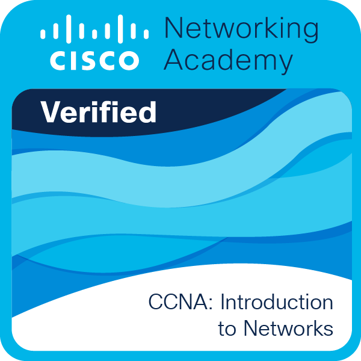
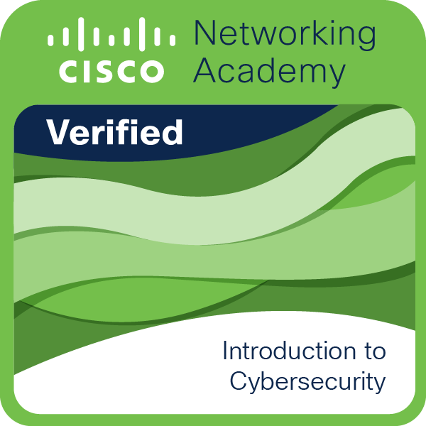

# amira404.github.io
My personal portfolio and projects hosted on GitHub Pages.
Hi there 👋

I’m Amira Muhammad, a Cybersecurity Specialist with a strong foundation in network security, penetration testing, and digital forensics.
I graduated in Cybersecurity & Data Analysis and trained extensively through ITI & DEPI programs, gaining solid hands-on experience in:

🔹 Network configuration & defense (CCNA, Fortinet, ASA, GNS3, VMware)

🔹 System administration (Linux – Red Hat, CentOS, Kali, Windows Server)

🔹 Security operations & monitoring (SOC, SIEM, Syslog, DNS, Blue Teaming)

🔹 Vulnerability assessment, XSS, and SSTI exploitation labs

🔹 Automation & scripting with Python, Bash, and OOP concepts

I’m passionate about Blue Team operations and committed to building secure, resilient systems that defend against real-world threats.

## 📜 Certifications  

    

📫 Let’s connect:
+201019850796 | amiramohamedwaly@gmail.com
✨ *Always learning, always securing.*  
